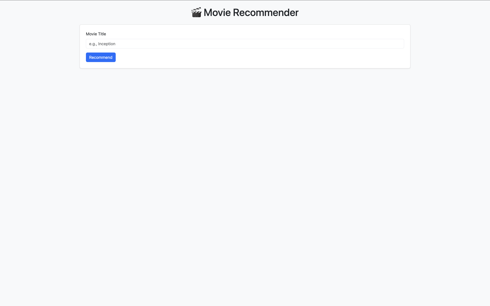
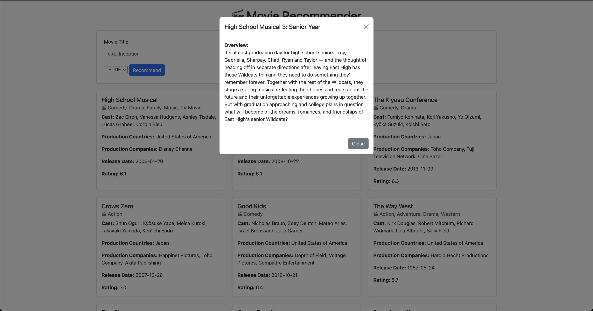
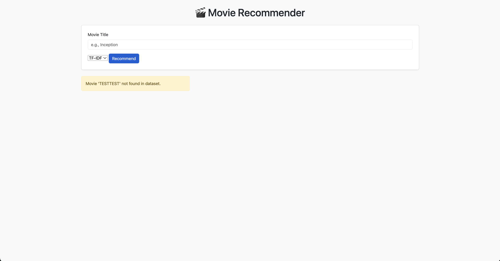

# Movie Recommendation System with Explainable AI

## Project Objective & Context

This project aims to develop a **content-based Movie Recommendation System** that leverages **TF-IDF** and **cosine similarity** to recommend movies based on their descriptions. The system incorporates **Explainable AI (XAI)** features to provide insights into why specific recommendations are made. It is implemented as a **Flask web API** with a **MongoDB backend** for data storage.

### Dataset
The dataset used for this project was sourced from [Kaggle]([https://www.kaggle.com/](https://www.kaggle.com/datasets/rounakbanik/the-movies-dataset)), containing movie metadata.

### Problem Statement
With the growing volume of movies available, users often struggle to find content tailored to their preferences. This project addresses the challenge by building a recommendation system that provides personalized movie suggestions while ensuring transparency through explainable recommendations.

### Goals
- **Recommendation Engine**: Suggest movies based on content similarity.
- **Explainability**: Provide clear explanations for recommendations.
- **Scalable Design**: Modular architecture with a Flask API and MongoDB integration.

### Assumptions and Hypotheses
- Movie descriptions and metadata are sufficient to capture user preferences.
- TF-IDF effectively represents textual data for similarity computation.
- Users value transparency in recommendation systems.

---

## Technical Overview

### Features
- **Content-Based Filtering**: Recommends movies using TF-IDF and cosine similarity.
- **Explainable AI**: Highlights key features contributing to recommendations.
- **Modular Design**: Separation of concerns for data processing, model training, and API.
- **Flask API**: Exposes endpoints for recommendations and explanations.
- **MongoDB Integration**: Stores movie data and user interactions.

### Project Structure
```
MovieRecommendation/
├── src/
│   ├── data_processing/      # ETL: cleaning, feature‐engineering, loaders
│   │   ├── clean_dataset.py
│   │   ├── data_cleaner.py
│   │   ├── data_loader.py
│   │   └── mongodb_handler.py
│   │
│   ├── model/                # Training & serialization
│   │   └── build_model.py    # TF-IDF fitting, cosine matrix, save artifacts
│   │
│   └── main/                 # Flask web layer
│       ├── app.py        
│       ├── explanation.py        
│       ├── recommendation.py        
│       ├── static/          
│       │   └── script.js
│       └── templates/        
│           ├── index.html
│           ├── 404.html
│           └── 500.html
│
├── data/                     # raw CSVs
│   ├── credits.csv                  
│   ├── keywords.csv            
│   └── movies_metadata.csv         
│
├── created_model/            # created .pkl model
│   └── light_model.pkl
│
├── .env.example              # env template (MONGO_URI, DB_NAME, COLLECTION_NAME, SECRET_KEY)
├── requirements.txt          # Required dependencies
└── README.md                

```

---

## Installation
1. **Clone the repository**:
   ```bash
   git clone https://github.com/yourusername/MovieRecommendation.git
   cd MovieRecommendation
   ```

2. **Set up a virtual environment**:
   ```bash
   python3 -m venv venv
   source venv/bin/activate       # macOS/Linux
   venv\Scripts\activate          # Windows
   ```

3. **Install dependencies**:
   ```bash
   pip install -r requirements.txt
   ```

4. **Configure environment variables**:
   - Copy `.env_example` to `.env`:
     ```bash
     cp .env_example .env
     ```
   - Update `.env` with your MongoDB URI:
     ```
     MONGO_URI=mongodb://localhost:27017/movies
     ```

5. **Dataset Setup**:

Due to file size limits on GitHub, the raw CSVs are not included in this repository. Please download the following files from Kaggle and place them into the `data/` folder before running the pipeline:

1. [movies_metadata.csv](https://www.kaggle.com/datasets/rounakbanik/the-movies-dataset?select=movies_metadata.csv)  
2. [credits.csv](https://www.kaggle.com/datasets/rounakbanik/the-movies-dataset?select=credits.csv)  
3. [keywords.csv](https://www.kaggle.com/datasets/rounakbanik/the-movies-dataset?select=keywords.csv)  

---

## Running the Project

1. **Data Cleaning & Preparation**  
   ```bash
   python src/data_processing/clean_dataset.py
   ```

2. **Model Training & Serialization**  
   ```bash
   python src/model/build_model.py
   ```

3. **Start the Flask API**  
   ```bash
   python src/main/app.py
   ```  

4. **Open the Application**  
   Once the Flask API is running, open your browser and navigate to [http://127.0.0.1:5000/](http://127.0.0.1:5000/) to access the application.

---

## 📊 API Usage

### Endpoints
1. **Get Recommendations**  
  - **URL**: `/`
  - **Method**: `POST`
  - **Description**: Submits a movie title to fetch recommendations. Handles errors gracefully and provides a list of similar movies with their similarity scores.

---

## Reproducibility & Configuration

### Environment Variables
- **MONGO_URI**: MongoDB connection string (e.g., `mongodb://localhost:27017/movies`).

### Reproducibility Steps
1. Ensure all dependencies are installed using `requirements.txt`.
2. Use the provided `.env_example` to configure your environment.
3. Follow the installation steps to preprocess data, train the model, and start the API.

---

## Use of AI Tools (Copilot & ChatGpt)

- **ChatGPT Assistance:**  
  - Drafted README structure and markdown (`README.md`).  
  - Generated boilerplate code snippets for Flask routes.  
  - Generated boilerplate HTML templates and JavaScript (`.html` & `.js`) for the frontend.  
- **Self-Developed:**  
  - Core TF-IDF computation & cosine similarity logic.  
  - XAI explanation extraction module.  
  - MongoDB integration and API orchestration.

---

## Documentation & Attribution

### External Sources
- **TF-IDF**: [Scikit-learn Documentation](https://scikit-learn.org/stable/modules/feature_extraction.html#tfidf-term-weighting)
- **Flask**: [Flask Documentation](https://flask.palletsprojects.com/)
- **MongoDB**: [MongoDB Documentation](https://www.mongodb.com/docs/)

---
## Screenshots

### Movie recommender


### Recommendation Example


### Movie detail


### Error message

